# 🔄 Vault Secret Integration Process

[Go to the original Korean section below](#-vault-시크릿-연동-프로세스)

## 📋 Overview

This document describes the entire process for an application to securely fetch secrets by integrating with Vault. It uses sequence diagrams to represent a universally applicable procedure, regardless of the programming language.

## Option 1: Direct Vault API Integration (Recommended ✅)

1.  Vault Authentication and Token Issuance
2.  Token State Management
3.  Token Renewal Process
4.  Fetching Static Secrets (KV)
5.  Managing Dynamic Secrets (TTL-based)
6.  Integrated Process (Full Flow)

---

### 🔐 1.1: Vault Authentication and Token Issuance

#### AppRole Login Process

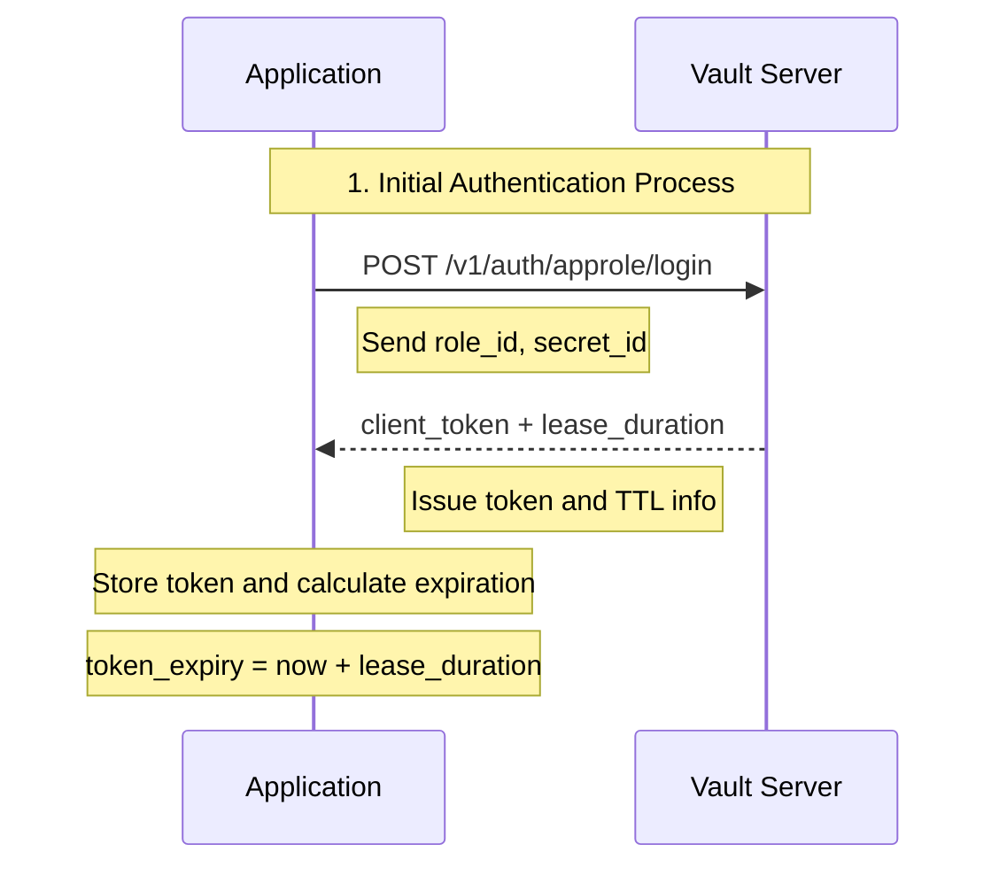
```mermaid
sequenceDiagram
    participant App as Application
    participant Vault as Vault Server

    Note over App,Vault: 1. Initial Authentication Process

    App->>Vault: POST /v1/auth/approle/login
    Note right of App: Send role_id, secret_id

    Vault-->>App: client_token + lease_duration
    Note left of Vault: Issue token and TTL info

    Note over App: Store token and calculate expiration
    Note over App: token_expiry = now + lease_duration
```

#### Token State Management

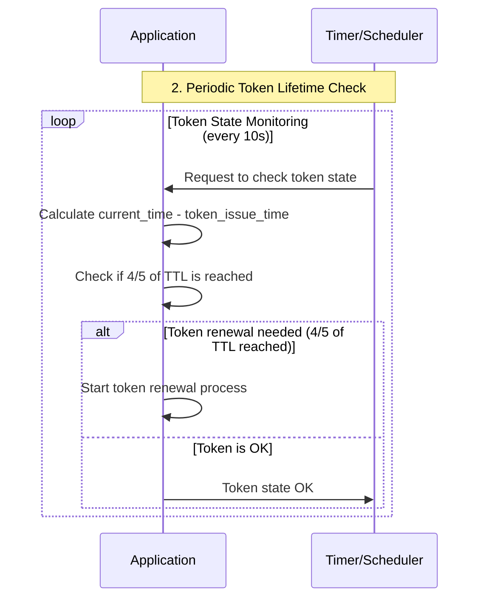
```mermaid
sequenceDiagram
    participant App as Application
    participant Timer as Timer/Scheduler

    Note over App,Timer: 2. Periodic Token Lifetime Check

    loop Token State Monitoring (every 10s)
        Timer->>App: Request to check token state
        App->>App: Calculate current_time - token_issue_time
        App->>App: Check if 4/5 of TTL is reached

        alt Token renewal needed (4/5 of TTL reached)
            App->>App: Start token renewal process
        else Token is OK
            App->>Timer: Token state OK
        end
    end
```

---

### 🔄 1.2: Token Renewal Process

#### Token Renewal and Failure Handling

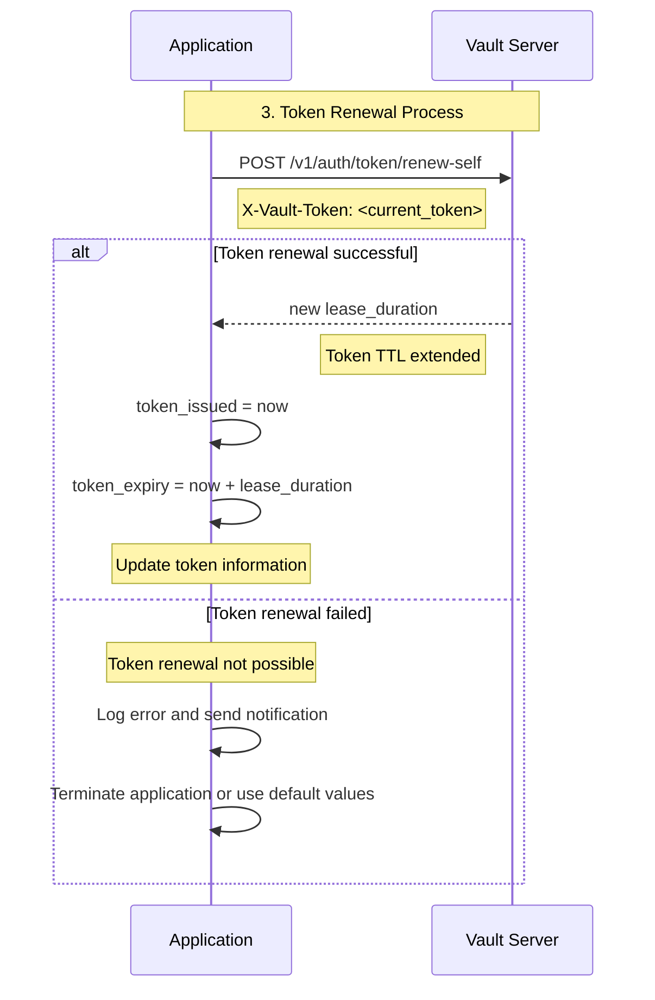
```mermaid
sequenceDiagram
    participant App as Application
    participant Vault as Vault Server

    Note over App,Vault: 3. Token Renewal Process

    App->>Vault: POST /v1/auth/token/renew-self
    Note right of App: X-Vault-Token: <current_token>

    alt Token renewal successful
        Vault-->>App: new lease_duration
        Note left of Vault: Token TTL extended

        App->>App: token_issued = now
        App->>App: token_expiry = now + lease_duration
        Note over App: Update token information

    else Token renewal failed
        Note over App: Token renewal not possible
        App->>App: Log error and send notification
        App->>App: Terminate application or use default values
    end
```

---

### 🔑 1.3: Fetching Static Secrets (KV)

#### KV Secret Retrieval and Caching

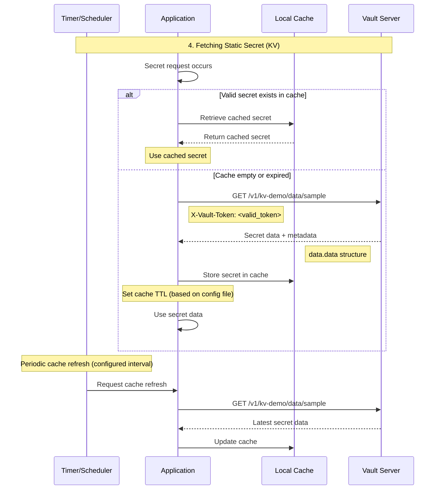
```mermaid
sequenceDiagram
    participant Timer as Timer/Scheduler
    participant App as Application
    participant Cache as Local Cache
    participant Vault as Vault Server

    Note over Timer,Vault: 4. Fetching Static Secret (KV)

    App->>App: Secret request occurs

    alt Valid secret exists in cache
        App->>Cache: Retrieve cached secret
        Cache-->>App: Return cached secret
        Note over App: Use cached secret

    else Cache empty or expired
        App->>Vault: GET /v1/kv-demo/data/sample
        Note right of App: X-Vault-Token: <valid_token>

        Vault-->>App: Secret data + metadata
        Note left of Vault: data.data structure

        App->>Cache: Store secret in cache
        Note over App: Set cache TTL (based on config file)

        App->>App: Use secret data
    end

    Note over Timer: Periodic cache refresh (configured interval)
    Timer->>App: Request cache refresh
    App->>Vault: GET /v1/kv-demo/data/sample
    Vault-->>App: Latest secret data
    App->>Cache: Update cache
```

---

### ⏰ 1.4: Managing Dynamic Secrets (TTL-based)

#### TTL-based Secret Renewal

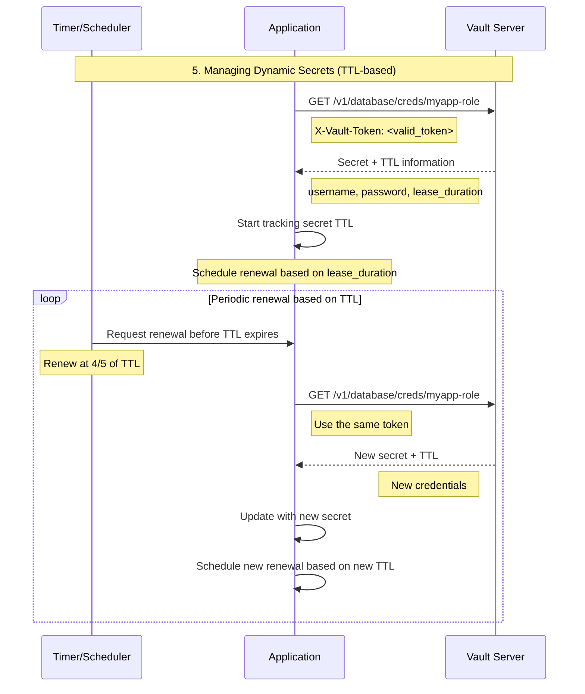
```mermaid
sequenceDiagram
    participant Timer as Timer/Scheduler
    participant App as Application
    participant Vault as Vault Server

    Note over Timer,Vault: 5. Managing Dynamic Secrets (TTL-based)

    App->>Vault: GET /v1/database/creds/myapp-role
    Note right of App: X-Vault-Token: <valid_token>

    Vault-->>App: Secret + TTL information
    Note left of Vault: username, password, lease_duration

    App->>App: Start tracking secret TTL
    Note over App: Schedule renewal based on lease_duration

    loop Periodic renewal based on TTL
        Timer->>App: Request renewal before TTL expires
        Note over Timer: Renew at 4/5 of TTL

        App->>Vault: GET /v1/database/creds/myapp-role
        Note right of App: Use the same token

        Vault-->>App: New secret + TTL
        Note left of Vault: New credentials

        App->>App: Update with new secret
        App->>App: Schedule new renewal based on new TTL
    end
```

---

### 🔄 1.5: Integrated Process (Full Flow)

#### Complete Vault Integration Process

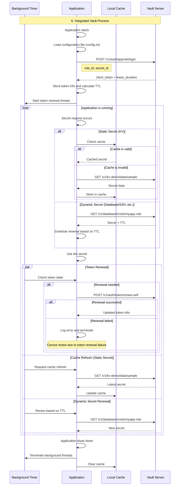
```mermaid
sequenceDiagram
    participant Timer as Background Timer
    participant App as Application
    participant Cache as Local Cache
    participant Vault as Vault Server

    Note over Timer,Vault: 6. Integrated Vault Process

    %% Initialization Phase
    App->>App: Application starts
    App->>App: Load configuration file (config.ini)

    %% Authentication Phase
    App->>Vault: POST /v1/auth/approle/login
    Note right of App: role_id, secret_id

    Vault-->>App: client_token + lease_duration
    App->>App: Store token info and calculate TTL

    %% Start Background Token Management
    App->>Timer: Start token renewal thread

    %% Main Loop
    loop Application is running
        %% Secret Request
        App->>App: Secret request occurs

        alt Static Secret (KV)
            App->>Cache: Check cache

            alt Cache is valid
                Cache-->>App: Cached secret
            else Cache is invalid
                App->>Vault: GET /v1/kv-demo/data/sample
                Vault-->>App: Secret data
                App->>Cache: Store in cache
            end

        else Dynamic Secret (Database/SSH, etc.)
            App->>Vault: GET /v1/database/creds/myapp-role
            Vault-->>App: Secret + TTL
            App->>App: Schedule renewal based on TTL
        end

        App->>App: Use the secret

        %% Background Processes
        par Token Renewal
            Timer->>App: Check token state
            alt Renewal needed
                App->>Vault: POST /v1/auth/token/renew-self
                alt Renewal successful
                    Vault-->>App: Updated token info
                else Renewal failed
                    App->>App: Log error and terminate
                    Note over App: Cannot renew due to token renewal failure
                end
            end
        and Cache Refresh (Static Secret)
            Timer->>App: Request cache refresh
            App->>Vault: GET /v1/kv-demo/data/sample
            Vault-->>App: Latest secret
            App->>Cache: Update cache
        and Dynamic Secret Renewal
            Timer->>App: Renew based on TTL
            App->>Vault: GET /v1/database/creds/myapp-role
            Vault-->>App: New secret
        end
    end

    %% Shutdown Process
    App->>App: Application shuts down
    App->>Timer: Terminate background threads
    App->>Cache: Clear cache
```

---

## Option 2: Using Vault Proxy (When Token Management is Not Feasible)

The conditions for using Option 2 are as follows:
- Option 2 is used when the token management part of Option 1's process is not feasible.
  - For scripts, implementing token management with multi-threading can be difficult.
- It is used when managing elements required for Vault login (e.g., AppRole Secret_id, Password) is difficult.

The process is the same as Option 1, but with the login and token management parts excluded. The rest is identical to Option 1.

1.  Fetching Static Secrets (KV)
2.  Managing Dynamic Secrets (TTL-based)
3.  Integrated Process (Full Flow)

---

## Option 3: Vault Agent + Environment Variable/File Injection (For Legacy Apps)

The conditions for using Option 3 are as follows:
- Option 3 is used when the token management part of Option 1's process is not feasible.
- It is used for permanently running services rather than one-off tasks like scripts.
- It is used when managing elements required for Vault login (e.g., AppRole Secret_id, Password) is difficult.

### 🔧 3.1: Execute Command After Creating Environment Variables

#### Vault Agent Environment Variable Injection Process

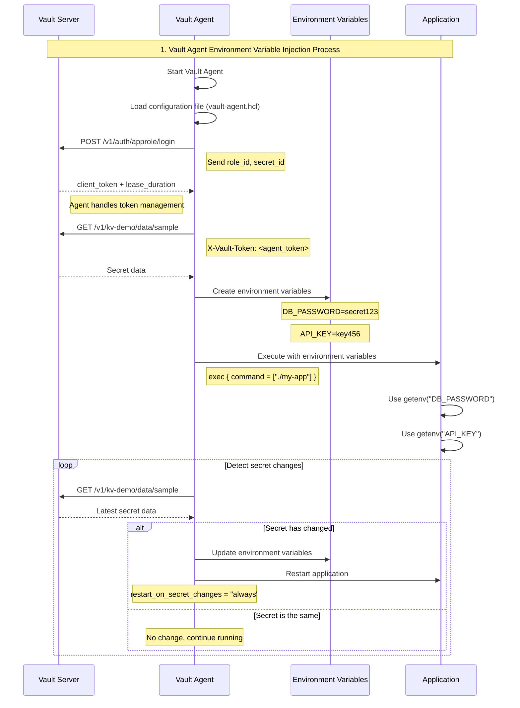
```mermaid
sequenceDiagram
    participant Vault as Vault Server
    participant Agent as Vault Agent
    participant Env as Environment Variables
    participant App as Application

    Note over Vault,App: 1. Vault Agent Environment Variable Injection Process

    %% Agent Initialization
    Agent->>Agent: Start Vault Agent
    Agent->>Agent: Load configuration file (vault-agent.hcl)

    %% Vault Authentication
    Agent->>Vault: POST /v1/auth/approle/login
    Note right of Agent: Send role_id, secret_id

    Vault-->>Agent: client_token + lease_duration
    Note left of Agent: Agent handles token management

    %% Create Environment Variables
    Agent->>Vault: GET /v1/kv-demo/data/sample
    Note right of Agent: X-Vault-Token: <agent_token>

    Vault-->>Agent: Secret data
    Agent->>Env: Create environment variables
    Note over Env: DB_PASSWORD=secret123
    Note over Env: API_KEY=key456

    %% Execute Application
    Agent->>App: Execute with environment variables
    Note right of Agent: exec { command = ["./my-app"] }

    App->>App: Use getenv("DB_PASSWORD")
    App->>App: Use getenv("API_KEY")

    %% Periodic Renewal
    loop Detect secret changes
        Agent->>Vault: GET /v1/kv-demo/data/sample
        Vault-->>Agent: Latest secret data

        alt Secret has changed
            Agent->>Env: Update environment variables
            Agent->>App: Restart application
            Note over Agent: restart_on_secret_changes = "always"
        else Secret is the same
            Note over Agent: No change, continue running
        end
    end
```

### 📄 3.2: Execute Command After Rendering File Template

#### Vault Agent File Template Process

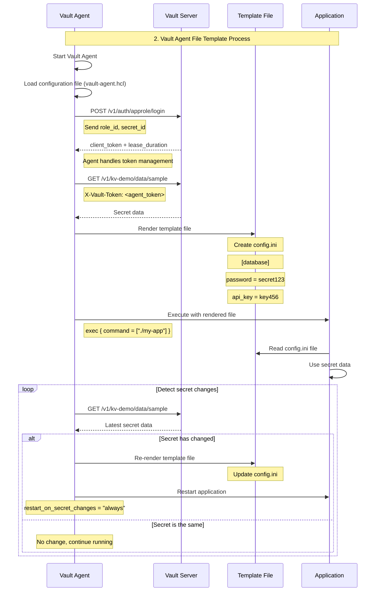
```mermaid
sequenceDiagram
    participant Agent as Vault Agent
    participant Vault as Vault Server
    participant File as Template File
    participant App as Application

    Note over Agent,App: 2. Vault Agent File Template Process

    %% Agent Initialization
    Agent->>Agent: Start Vault Agent
    Agent->>Agent: Load configuration file (vault-agent.hcl)

    %% Vault Authentication
    Agent->>Vault: POST /v1/auth/approle/login
    Note right of Agent: Send role_id, secret_id

    Vault-->>Agent: client_token + lease_duration
    Note left of Vault: Agent handles token management

    %% Render Template File
    Agent->>Vault: GET /v1/kv-demo/data/sample
    Note right of Agent: X-Vault-Token: <agent_token>

    Vault-->>Agent: Secret data
    Agent->>File: Render template file
    Note over File: Create config.ini
    Note over File: [database]
    Note over File: password = secret123
    Note over File: api_key = key456

    %% Execute Application
    Agent->>App: Execute with rendered file
    Note right of Agent: exec { command = ["./my-app"] }

    App->>File: Read config.ini file
    App->>App: Use secret data

    %% Periodic Renewal
    loop Detect secret changes
        Agent->>Vault: GET /v1/kv-demo/data/sample
        Vault-->>Agent: Latest secret data

        alt Secret has changed
            Agent->>File: Re-render template file
            Note over File: Update config.ini
            Agent->>App: Restart application
            Note over Agent: restart_on_secret_changes = "always"
        else Secret is the same
            Note over Agent: No change, continue running
        end
    end
```

---

## 🎯 Core Principles

### 1. **Token Management**
- Renew token at 4/5 of its TTL.
- Do not attempt to re-login on renewal failure (possibility of `secret_id` expiration).
- Continuously monitor in the background.

### 2. **Secret Caching**
- Static Secrets: Configuration-based cache TTL.
- Dynamic Secrets: Automatic renewal based on Vault TTL.
- Store only in memory, do not save to files.

### 3. **Error Recovery**
- On token renewal failure, terminate the application or use default values.
- Do not attempt to re-login if the `secret_id` expires.
- On failure, ensure a safe shutdown or use default values.

### 4. **Security Considerations**
- Use secrets only in memory.
- Do not print secret data in logs.
- Set appropriate token expiration times.
- Perform regular security audits.

---

# 🔄 Vault 시크릿 연동 프로세스

## 📋 개요

이 문서는 애플리케이션이 Vault와 연동하여 시크릿을 안전하게 가져오는 전체 프로세스를 설명합니다. 언어에 상관없이 범용적으로 적용 가능한 절차를 sequence 다이어그램으로 표현합니다.

## 1안: Vault API 직접 연계 (권고안 ✅)

1. Vault 인증 및 토큰 발급
2. 토큰 상태 관리
3. 토큰 갱신 프로세스
4. 정적 시크릿 (KV) 가져오기
5. 동적 시크릿 (TTL 기반) 관리
6. 통합 프로세스 (전체 플로우)

---

### 🔐 1.1: Vault 인증 및 토큰 발급

#### AppRole 로그인 프로세스

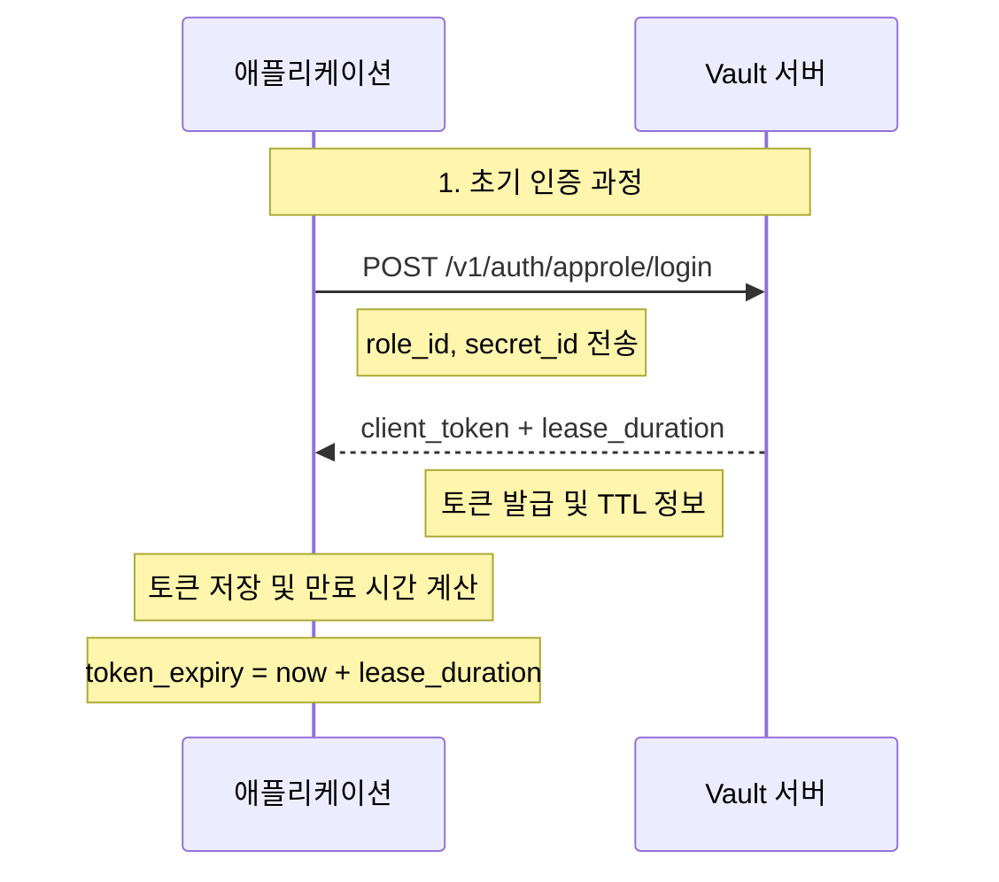
```mermaid
sequenceDiagram
    participant App as 애플리케이션
    participant Vault as Vault 서버
    
    Note over App,Vault: 1. 초기 인증 과정
    
    App->>Vault: POST /v1/auth/approle/login
    Note right of App: role_id, secret_id 전송
    
    Vault-->>App: client_token + lease_duration
    Note left of Vault: 토큰 발급 및 TTL 정보
    
    Note over App: 토큰 저장 및 만료 시간 계산
    Note over App: token_expiry = now + lease_duration
```

#### 토큰 상태 관리

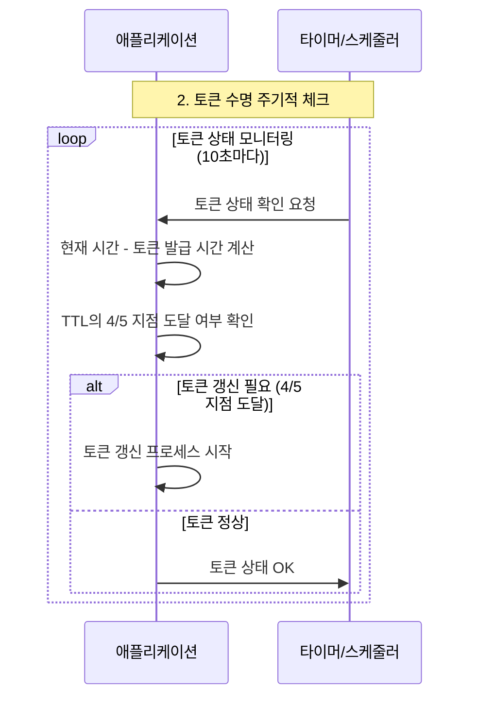
```mermaid
sequenceDiagram
    participant App as 애플리케이션
    participant Timer as 타이머/스케줄러
    
    Note over App,Timer: 2. 토큰 수명 주기적 체크
    
    loop 토큰 상태 모니터링 (10초마다)
        Timer->>App: 토큰 상태 확인 요청
        App->>App: 현재 시간 - 토큰 발급 시간 계산
        App->>App: TTL의 4/5 지점 도달 여부 확인
        
        alt 토큰 갱신 필요 (4/5 지점 도달)
            App->>App: 토큰 갱신 프로세스 시작
        else 토큰 정상
            App->>Timer: 토큰 상태 OK
        end
    end
```

---

### 🔄 1.2: 토큰 갱신 프로세스

#### 토큰 갱신 및 실패 처리

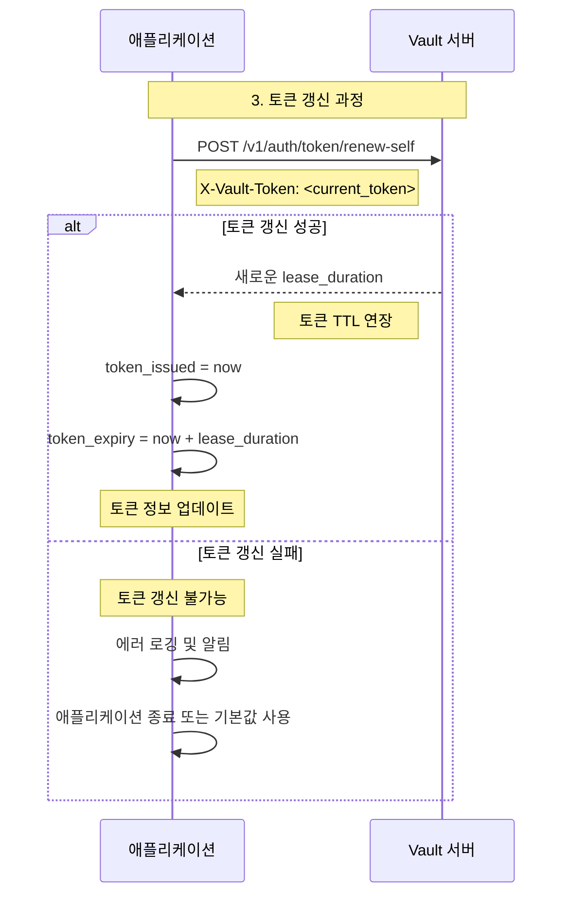
```mermaid
sequenceDiagram
    participant App as 애플리케이션
    participant Vault as Vault 서버
    
    Note over App,Vault: 3. 토큰 갱신 과정
    
    App->>Vault: POST /v1/auth/token/renew-self
    Note right of App: X-Vault-Token: <current_token>
    
    alt 토큰 갱신 성공
        Vault-->>App: 새로운 lease_duration
        Note left of Vault: 토큰 TTL 연장
        
        App->>App: token_issued = now
        App->>App: token_expiry = now + lease_duration
        Note over App: 토큰 정보 업데이트
        
    else 토큰 갱신 실패
        Note over App: 토큰 갱신 불가능
        App->>App: 에러 로깅 및 알림
        App->>App: 애플리케이션 종료 또는 기본값 사용
    end
```

---

### 🔑 1.3: 정적 시크릿 (KV) 가져오기

#### KV 시크릿 조회 및 캐싱

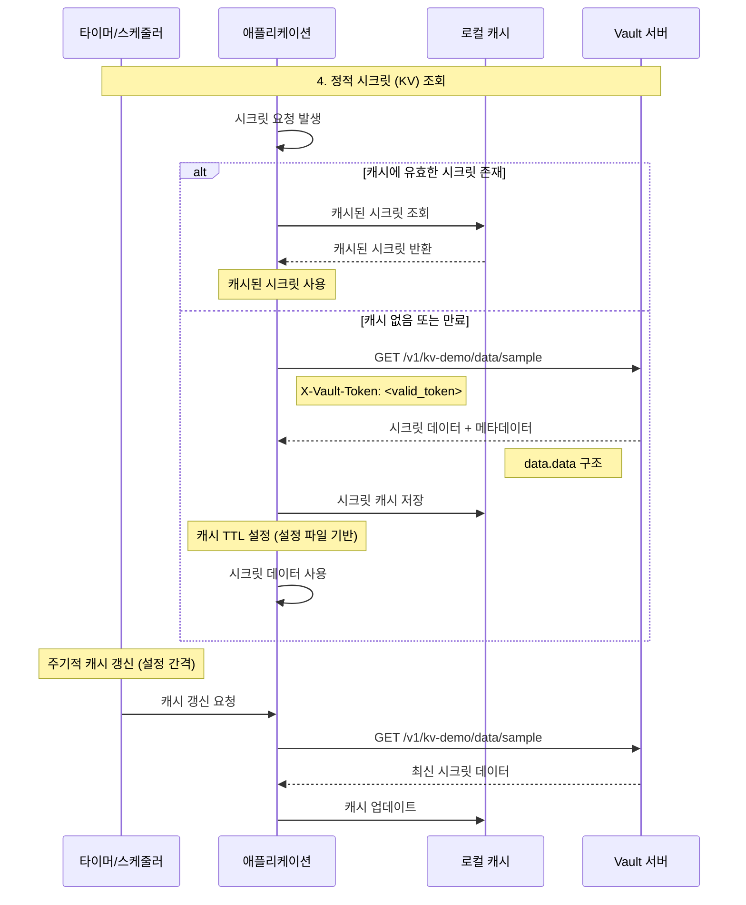
```mermaid
sequenceDiagram
    participant Timer as 타이머/스케줄러
    participant App as 애플리케이션
    participant Cache as 로컬 캐시
    participant Vault as Vault 서버
    
    Note over Timer,Vault: 4. 정적 시크릿 (KV) 조회
    
    App->>App: 시크릿 요청 발생
    
    alt 캐시에 유효한 시크릿 존재
        App->>Cache: 캐시된 시크릿 조회
        Cache-->>App: 캐시된 시크릿 반환
        Note over App: 캐시된 시크릿 사용
        
    else 캐시 없음 또는 만료
        App->>Vault: GET /v1/kv-demo/data/sample
        Note right of App: X-Vault-Token: <valid_token>
        
        Vault-->>App: 시크릿 데이터 + 메타데이터
        Note left of Vault: data.data 구조
        
        App->>Cache: 시크릿 캐시 저장
        Note over App: 캐시 TTL 설정 (설정 파일 기반)
        
        App->>App: 시크릿 데이터 사용
    end
    
    Note over Timer: 주기적 캐시 갱신 (설정 간격)
    Timer->>App: 캐시 갱신 요청
    App->>Vault: GET /v1/kv-demo/data/sample
    Vault-->>App: 최신 시크릿 데이터
    App->>Cache: 캐시 업데이트
```

---

### ⏰ 1.4: 동적 시크릿 (TTL 기반) 관리

#### TTL 기반 시크릿 갱신

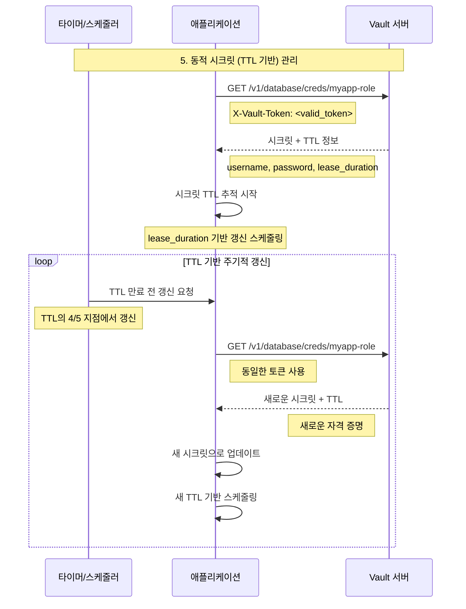
```mermaid
sequenceDiagram
    participant Timer as 타이머/스케줄러
    participant App as 애플리케이션
    participant Vault as Vault 서버
    
    Note over Timer,Vault: 5. 동적 시크릿 (TTL 기반) 관리
    
    App->>Vault: GET /v1/database/creds/myapp-role
    Note right of App: X-Vault-Token: <valid_token>
    
    Vault-->>App: 시크릿 + TTL 정보
    Note left of Vault: username, password, lease_duration
    
    App->>App: 시크릿 TTL 추적 시작
    Note over App: lease_duration 기반 갱신 스케줄링
    
    loop TTL 기반 주기적 갱신
        Timer->>App: TTL 만료 전 갱신 요청
        Note over Timer: TTL의 4/5 지점에서 갱신
        
        App->>Vault: GET /v1/database/creds/myapp-role
        Note right of App: 동일한 토큰 사용
        
        Vault-->>App: 새로운 시크릿 + TTL
        Note left of Vault: 새로운 자격 증명
        
        App->>App: 새 시크릿으로 업데이트
        App->>App: 새 TTL 기반 스케줄링
    end
```

---

### 🔄 1.5: 통합 프로세스 (전체 플로우)

#### 완전한 Vault 연동 프로세스

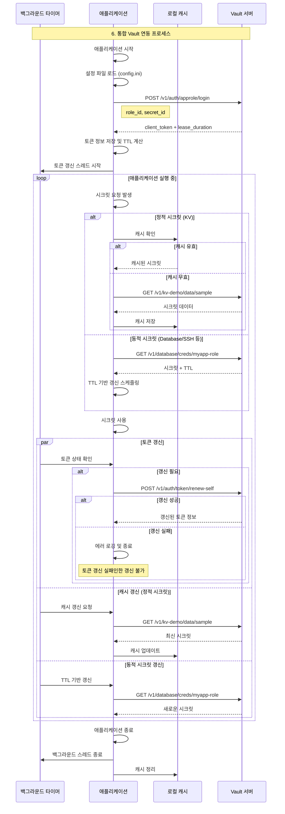
```mermaid
sequenceDiagram
    participant Timer as 백그라운드 타이머
    participant App as 애플리케이션
    participant Cache as 로컬 캐시
    participant Vault as Vault 서버
    
    Note over Timer,Vault: 6. 통합 Vault 연동 프로세스
    
    %% 초기화 단계
    App->>App: 애플리케이션 시작
    App->>App: 설정 파일 로드 (config.ini)
    
    %% 인증 단계
    App->>Vault: POST /v1/auth/approle/login
    Note right of App: role_id, secret_id
    
    Vault-->>App: client_token + lease_duration
    App->>App: 토큰 정보 저장 및 TTL 계산
    
    %% 백그라운드 토큰 관리 시작
    App->>Timer: 토큰 갱신 스레드 시작
    
    %% 메인 루프
    loop 애플리케이션 실행 중
        %% 시크릿 요청
        App->>App: 시크릿 요청 발생
        
        alt 정적 시크릿 (KV)
            App->>Cache: 캐시 확인
            
            alt 캐시 유효
                Cache-->>App: 캐시된 시크릿
            else 캐시 무효
                App->>Vault: GET /v1/kv-demo/data/sample
                Vault-->>App: 시크릿 데이터
                App->>Cache: 캐시 저장
            end
            
        else 동적 시크릿 (Database/SSH 등)
            App->>Vault: GET /v1/database/creds/myapp-role
            Vault-->>App: 시크릿 + TTL
            App->>App: TTL 기반 갱신 스케줄링
        end
        
        App->>App: 시크릿 사용
        
        %% 백그라운드 프로세스
        par 토큰 갱신
            Timer->>App: 토큰 상태 확인
            alt 갱신 필요
                App->>Vault: POST /v1/auth/token/renew-self
                alt 갱신 성공
                    Vault-->>App: 갱신된 토큰 정보
                else 갱신 실패
                    App->>App: 에러 로깅 및 종료
                    Note over App: 토큰 갱신 실패인한 갱신 불가
                end
            end
        and 캐시 갱신 (정적 시크릿)
            Timer->>App: 캐시 갱신 요청
            App->>Vault: GET /v1/kv-demo/data/sample
            Vault-->>App: 최신 시크릿
            App->>Cache: 캐시 업데이트
        and 동적 시크릿 갱신
            Timer->>App: TTL 기반 갱신
            App->>Vault: GET /v1/database/creds/myapp-role
            Vault-->>App: 새로운 시크릿
        end
    end
    
    %% 종료 처리
    App->>App: 애플리케이션 종료
    App->>Timer: 백그라운드 스레드 종료
    App->>Cache: 캐시 정리
```

---

## 2안: Vault Proxy 사용 (Token 관리가 불가능한 경우)

2안의 사용 조건은 다음과 같습니다.
- 2안은 1안의 프로세스 중 토큰 관리가 불가능한 경우에 사용합니다.
  - Script 같은 경우 멀티 쓰레딩으로 토큰 관리의 구현이 어렵습니다.
- Vault에 로그인 하기 위한 요소 (예: AppRole Secret_id, Password 등)를 관리하기 어려운 경우 사용합니다.

프로세스는 1안의 프로세스 중 로그인 및 토큰관리가 제외된 프로세스로 나머지 부분은 1안과 동일합니다.

1. 정적 시크릿 (KV) 가져오기
2. 동적 시크릿 (TTL 기반) 관리
3. 통합 프로세스 (전체 플로우)

---

## 3안: Vault Agent + 환경변수/파일 주입 (레거시 앱용)

3안의 사용 조건은 다음과 같습니다.
- 3안은 1안의 프로세스 중 토큰 관리가 불가능한 경우에 사용합니다.
- Script 같은 1회성 작업 보다는 영구적으로 실행되어야 하는 경우에 사용합니다.
- Vault에 로그인 하기 위한 요소 (예: AppRole Secret_id, Password 등)를 관리하기 어려운 경우 사용합니다.

### 🔧 3.1: 환경변수 생성 후 Command 실행

#### Vault Agent 환경변수 주입 프로세스

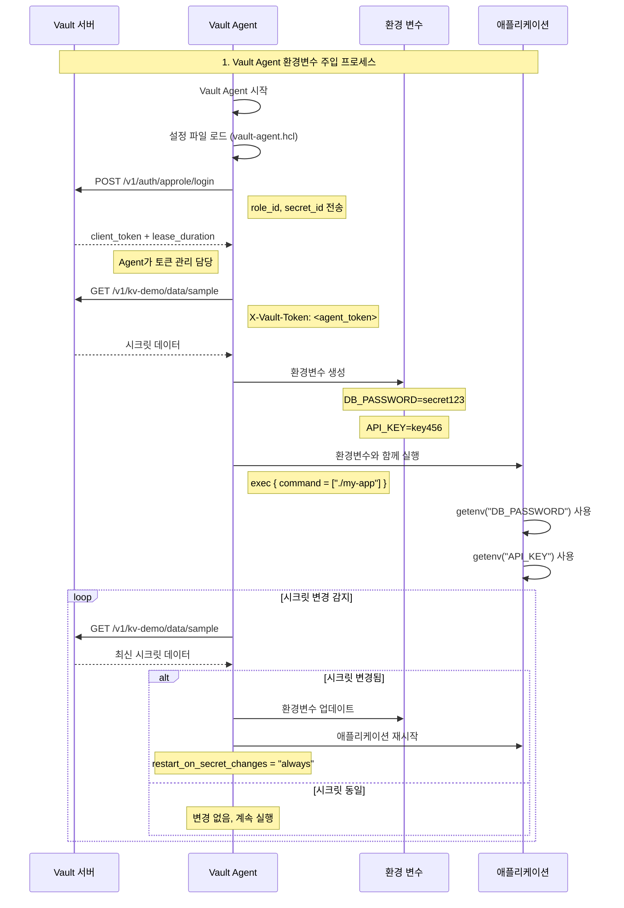
```mermaid
sequenceDiagram
    participant Vault as Vault 서버
    participant Agent as Vault Agent
    participant Env as 환경 변수
    participant App as 애플리케이션
    
    Note over Vault,App: 1. Vault Agent 환경변수 주입 프로세스
    
    %% Agent 초기화
    Agent->>Agent: Vault Agent 시작
    Agent->>Agent: 설정 파일 로드 (vault-agent.hcl)
    
    %% Vault 인증
    Agent->>Vault: POST /v1/auth/approle/login
    Note right of Agent: role_id, secret_id 전송
    
    Vault-->>Agent: client_token + lease_duration
    Note left of Agent: Agent가 토큰 관리 담당
    
    %% 환경변수 생성
    Agent->>Vault: GET /v1/kv-demo/data/sample
    Note right of Agent: X-Vault-Token: <agent_token>
    
    Vault-->>Agent: 시크릿 데이터
    Agent->>Env: 환경변수 생성
    Note over Env: DB_PASSWORD=secret123
    Note over Env: API_KEY=key456
    
    %% 애플리케이션 실행
    Agent->>App: 환경변수와 함께 실행
    Note right of Agent: exec { command = ["./my-app"] }
    
    App->>App: getenv("DB_PASSWORD") 사용
    App->>App: getenv("API_KEY") 사용
    
    %% 주기적 갱신
    loop 시크릿 변경 감지
        Agent->>Vault: GET /v1/kv-demo/data/sample
        Vault-->>Agent: 최신 시크릿 데이터
        
        alt 시크릿 변경됨
            Agent->>Env: 환경변수 업데이트
            Agent->>App: 애플리케이션 재시작
            Note over Agent: restart_on_secret_changes = "always"
        else 시크릿 동일
            Note over Agent: 변경 없음, 계속 실행
        end
    end
```

### 📄 3.2: 파일 템플릿 렌더링 후 Command 실행

#### Vault Agent 파일 템플릿 프로세스

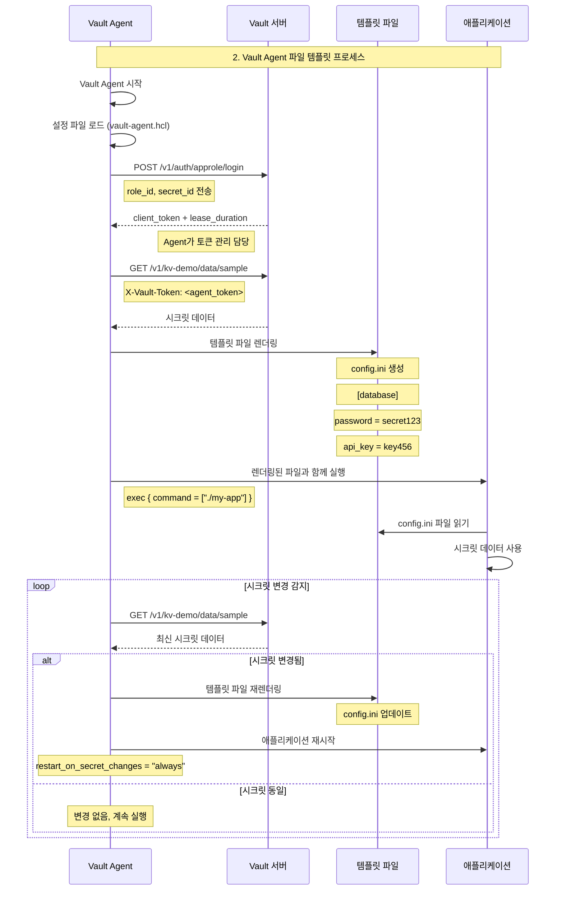
```mermaid
sequenceDiagram
    participant Agent as Vault Agent
    participant Vault as Vault 서버
    participant File as 템플릿 파일
    participant App as 애플리케이션
    
    Note over Agent,App: 2. Vault Agent 파일 템플릿 프로세스
    
    %% Agent 초기화
    Agent->>Agent: Vault Agent 시작
    Agent->>Agent: 설정 파일 로드 (vault-agent.hcl)
    
    %% Vault 인증
    Agent->>Vault: POST /v1/auth/approle/login
    Note right of Agent: role_id, secret_id 전송
    
    Vault-->>Agent: client_token + lease_duration
    Note left of Vault: Agent가 토큰 관리 담당
    
    %% 템플릿 파일 렌더링
    Agent->>Vault: GET /v1/kv-demo/data/sample
    Note right of Agent: X-Vault-Token: <agent_token>
    
    Vault-->>Agent: 시크릿 데이터
    Agent->>File: 템플릿 파일 렌더링
    Note over File: config.ini 생성
    Note over File: [database]
    Note over File: password = secret123
    Note over File: api_key = key456
    
    %% 애플리케이션 실행
    Agent->>App: 렌더링된 파일과 함께 실행
    Note right of Agent: exec { command = ["./my-app"] }
    
    App->>File: config.ini 파일 읽기
    App->>App: 시크릿 데이터 사용
    
    %% 주기적 갱신
    loop 시크릿 변경 감지
        Agent->>Vault: GET /v1/kv-demo/data/sample
        Vault-->>Agent: 최신 시크릿 데이터
        
        alt 시크릿 변경됨
            Agent->>File: 템플릿 파일 재렌더링
            Note over File: config.ini 업데이트
            Agent->>App: 애플리케이션 재시작
            Note over Agent: restart_on_secret_changes = "always"
        else 시크릿 동일
            Note over Agent: 변경 없음, 계속 실행
        end
    end
```

---

## 🎯 핵심 원칙

### 1. **토큰 관리**
- 토큰은 TTL의 4/5 지점에서 갱신
- 갱신 실패 시 재로그인 시도하지 않음 (secret_id 만료 가능성)
- 백그라운드에서 지속적 모니터링

### 2. **시크릿 캐싱**
- 정적 시크릿: 설정 기반 캐시 TTL
- 동적 시크릿: Vault TTL 기반 자동 갱신
- 메모리에서만 저장, 파일 저장 금지

### 3. **에러 복구**
- 토큰 갱신 실패 시 애플리케이션 종료 또는 기본값 사용
- secret_id 만료 시 재로그인 시도하지 않음
- 실패 시 안전한 종료 또는 기본값 사용

### 4. **보안 고려사항**
- 시크릿은 메모리에서만 사용
- 로그에 시크릿 데이터 출력 금지
- 토큰 만료 시간 적절히 설정
- 정기적인 보안 감사 수행

---
