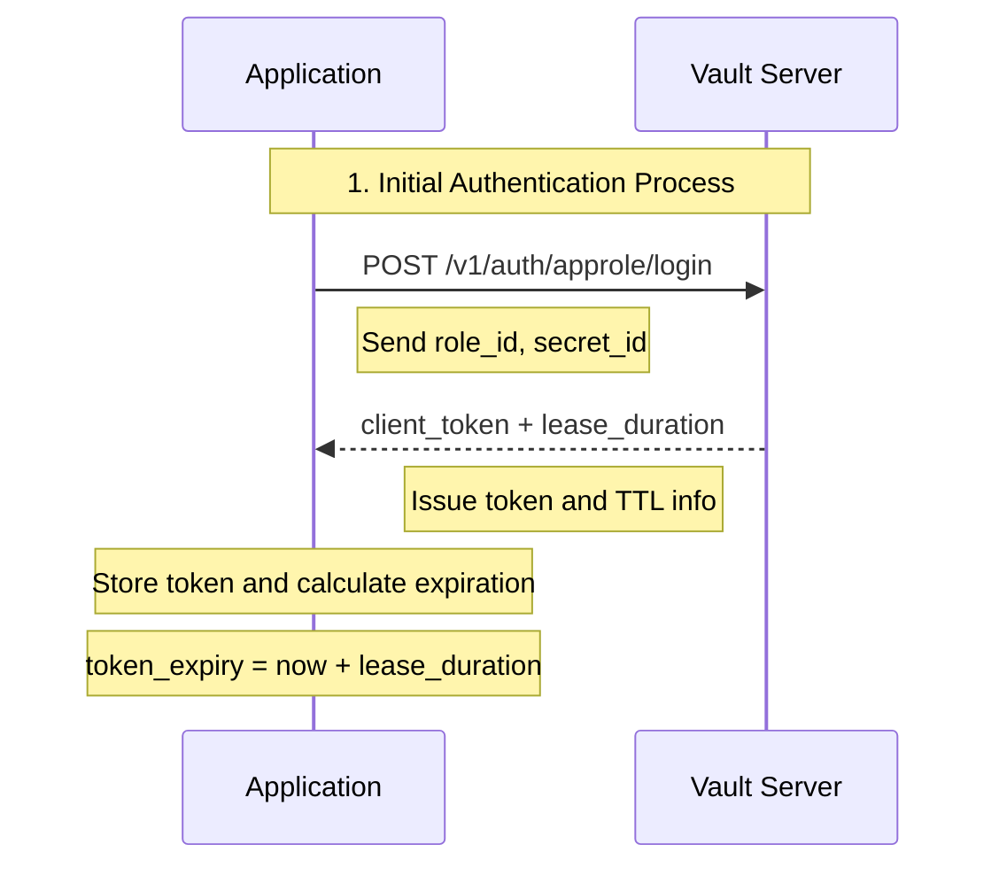
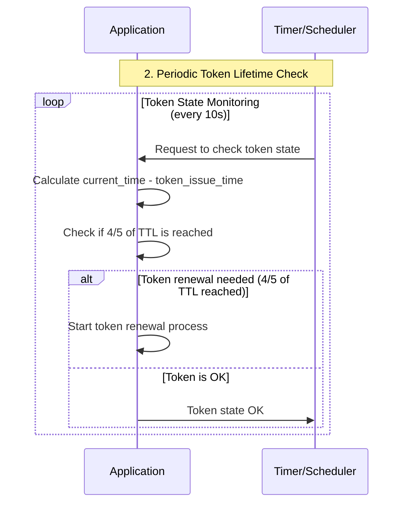
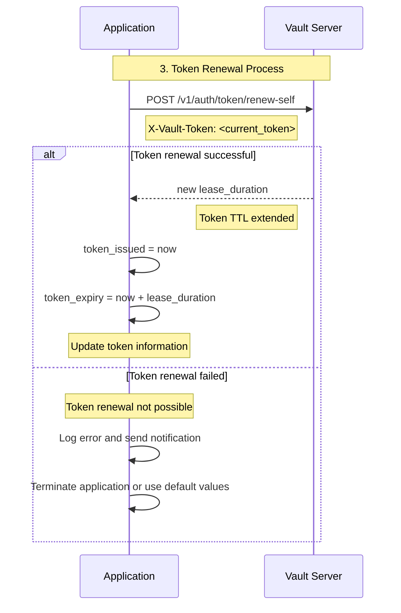
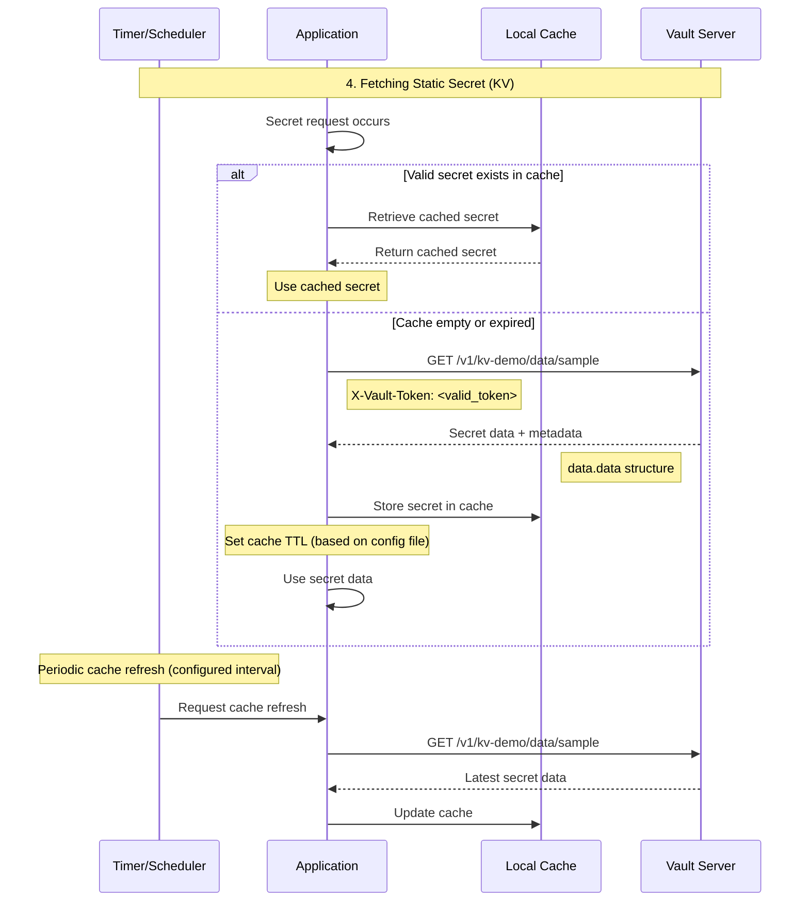
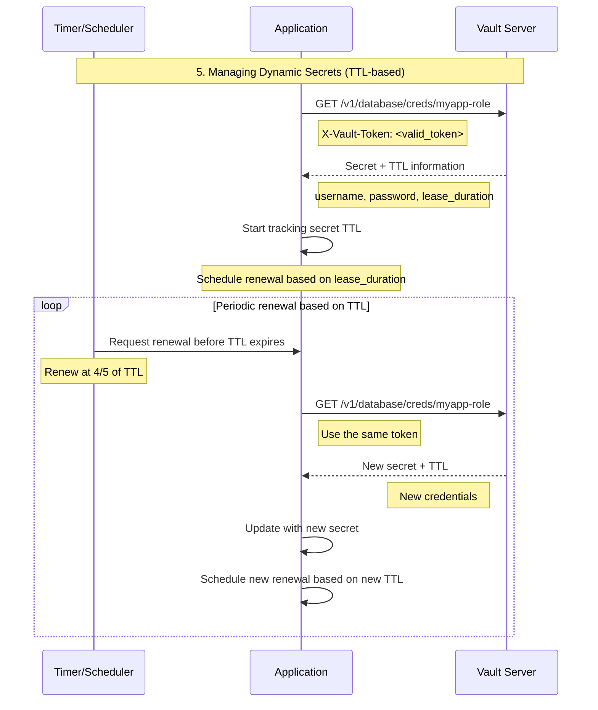
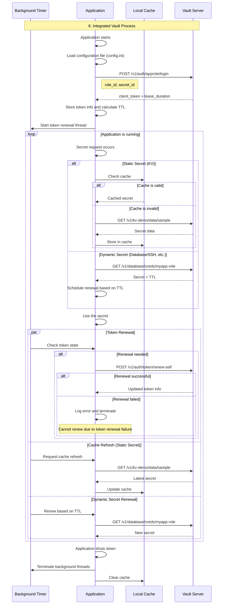
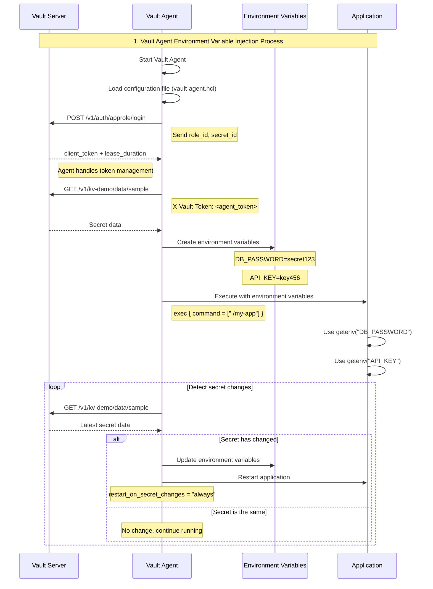
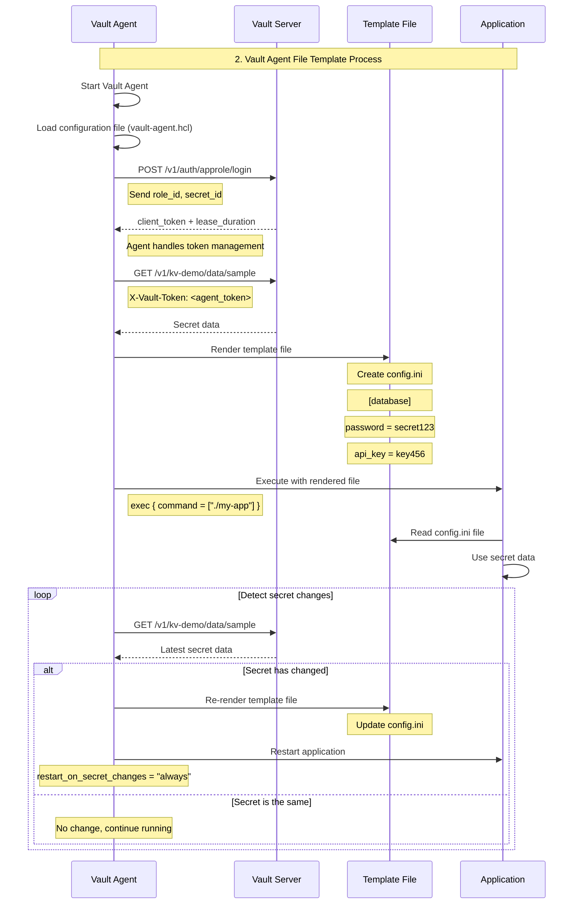

# Vault Secret Integration Process

## 📋 Overview

This document describes the entire process for an application to securely fetch secrets by integrating with Vault. It uses sequence diagrams to represent a universally applicable procedure, regardless of the programming language.

## Option 1: Direct Vault API Integration (Recommended ✅)

1.  Vault Authentication and Token Issuance
2.  Token State Management
3.  Token Renewal Process
4.  Fetching Static Secrets (KV)
5.  Managing Dynamic Secrets (TTL-based)
6.  Integrated Process (Full Flow)

---

### 🔐 1.1: Vault Authentication and Token Issuance

#### AppRole Login Process

#### Token State Management

---

### 🔄 1.2: Token Renewal Process

#### Token Renewal and Failure Handling

---

### 🔑 1.3: Fetching Static Secrets (KV)

#### KV Secret Retrieval and Caching

---

### ⏰ 1.4: Managing Dynamic Secrets (TTL-based)

#### TTL-based Secret Renewal

---

### 🔄 1.5: Integrated Process (Full Flow)

#### Complete Vault Integration Process

---

## Option 2: Using Vault Proxy (When Token Management is Not Feasible)

The conditions for using Option 2 are as follows:
- Option 2 is used when the token management part of Option 1's process is not feasible.
  - For scripts, implementing token management with multi-threading can be difficult.
- It is used when managing elements required for Vault login (e.g., AppRole Secret_id, Password) is difficult.

The process is the same as Option 1, but with the login and token management parts excluded. The rest is identical to Option 1.

1.  Fetching Static Secrets (KV)
2.  Managing Dynamic Secrets (TTL-based)
3.  Integrated Process (Full Flow)

---

## Option 3: Vault Agent + Environment Variable/File Injection (For Legacy Apps)

The conditions for using Option 3 are as follows:
- Option 3 is used when the token management part of Option 1's process is not feasible.
- It is used for permanently running services rather than one-off tasks like scripts.
- It is used when managing elements required for Vault login (e.g., AppRole Secret_id, Password) is difficult.

### 🔧 3.1: Execute Command After Creating Environment Variables

#### Vault Agent Environment Variable Injection Process

### 📄 3.2: Execute Command After Rendering File Template

#### Vault Agent File Template Process

---

## 🎯 Core Principles

### 1. **Token Management**
- Renew token at 4/5 of its TTL.
- Do not attempt to re-login on renewal failure (possibility of `secret_id` expiration).
- Continuously monitor in the background.

### 2. **Secret Caching**
- Static Secrets: Configuration-based cache TTL.
- Dynamic Secrets: Automatic renewal based on Vault TTL.
- Store only in memory, do not save to files.

### 3. **Error Recovery**
- On token renewal failure, terminate the application or use default values.
- Do not attempt to re-login if the `secret_id` expires.
- On failure, ensure a safe shutdown or use default values.

### 4. **Security Considerations**
- Use secrets only in memory.
- Do not print secret data in logs.
- Set appropriate token expiration times.
- Perform regular security audits.